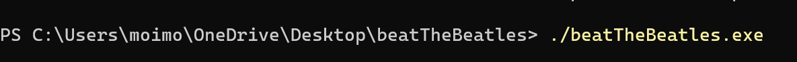
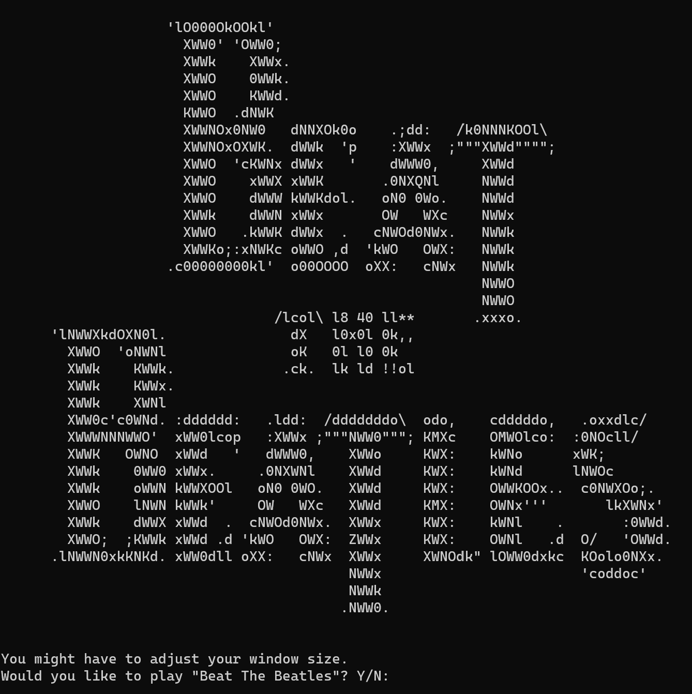
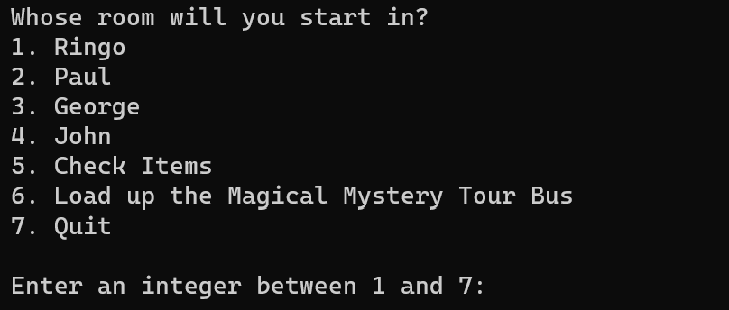
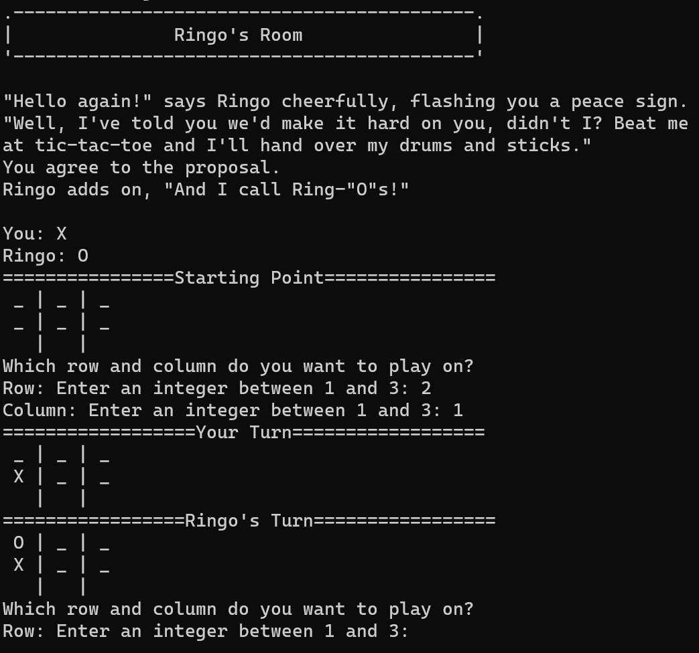
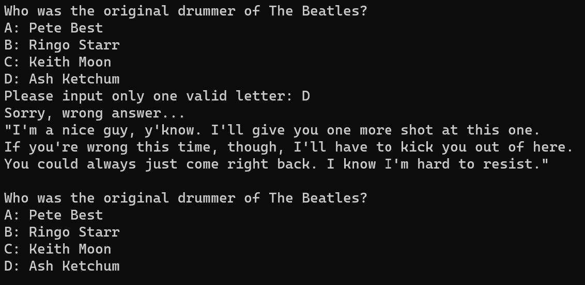
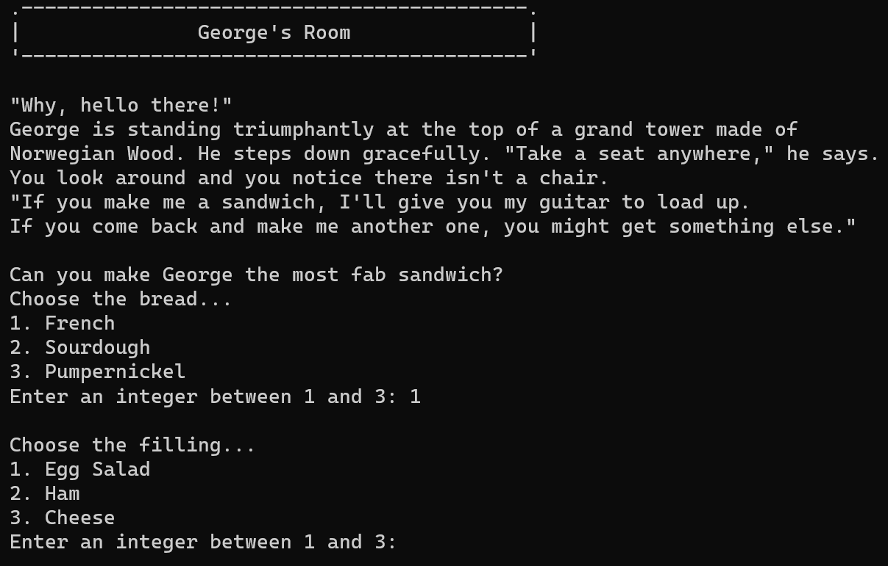
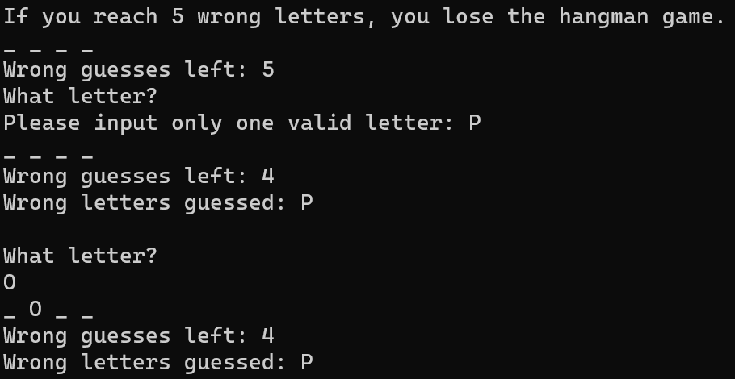
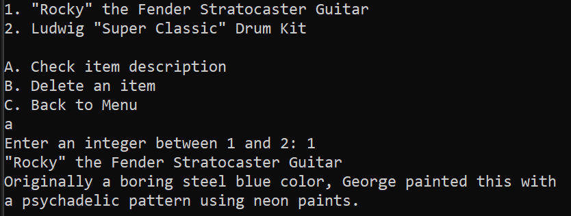
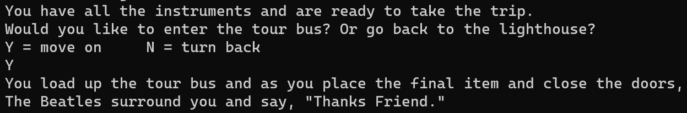

# What is Beat the Beatles?
Beat the Beatles is a text adventure game in which the user finds
themself miraculously cast as The Beatle's new roadie. Can you
collect all their gear in time? Or will your trip be a failure?
Play and find out!

# Introduction
This was the final project of Oregon State University Ecampus 
Intro to Computer Science II in Fall 2019, when it was offered
using C++.
Some of the requirements according to assignment specifications:

    1. Design a game with pointer-linked spaces

    2. Use object-oriented programming concepts

    3. Requires a "Space" class, representing the space the
      character can be in. Must be an abstract class with
      virtual functions.

    4. At least 3 derived classes from "Space"

    5. Have a limit to number of turns the user can take
      before losing the game

    6. Player must be able to interact with parts of the
      space structure

# Starting the Program
You will need to download the beatTheBeatles.zip file and unzip it.
You can double-click to run the game or use the terminal.
Enter into the newly created folder through your terminal.
Now, you can type "./beatTheBeatles.exe" to start the game
and follow the prompts.

# How to Play
When the game starts up, please adjust your window size and
type "Y" or "N" to decide whether you want to go on this trip or not.

You will now see the set-up of the story of the game. Ringo will greet
you and tell you to go to each member's room to pick up 
their respective instrument. 
Each room features a different minigame - if you win, you get the instrument
to load on the bus and if you lose you will need to try again.
You can also go back to the same room if you're really into beating the Beatles.
(Who wouldn't want to get another look at Paul, anyway?)
Type a number 1 thru 7 in the terminal to choose your next step 
according to the menu.

# Ringo's Room
Ringo will face you in a game of tic-tac-toe. Hopefully it will be easy
to beat him as his move is random. Make your move by first entering
the row, then enter the column of where you want to place your X.
If you succeed the first time, you will receive his drumset to 
load on the bus.

# Paul's Room
Paul will ask you a trivia question about The Beatles. If you get it
wrong, he will let you try again. But he only lets you slide once,
getting it wrong again will mean you need to re-enter his room and
spend another unit of time.

# George's Room
You will have to make a tasty sandwich for George. Pick from choices
of bread, protein, etc. Be careful, as he's pretty picky about
what he eats. If you fail, he'll throw you out and you'll have
to try making another sandwich.

# John's Room
John is going to face you in an hours long game of Monopoly!
... Just kidding. You're going to play hangman with him.
Input a letter at a time to guess a word related to John
himself or The Beatles in general. You have an allowance
of 5 wrong letters until you lose.

# Check Items
Check your inventory to see if you have the needed instruments.
If you went back to someone's room, you can see any additional
items as well. You can check the item description for some
fun easter eggs. 
! Please note that there is a bug with deleting items at this time.

# Load up the Magical Mystery Tour Bus
When you have the four needed instruments, choose to load up the 
tour bus. You will have the choice to complete the game or go
back and challenge The Beatles some more. Of course, if you 
do not have the required items, you will need to go back and
get them from those rascally boys.

# Quit
Quit the game. Self-explanatory but let me know if you have questions.

# Disclaimer
This is a fan game and is in no way associated with the actual The Beatles.
Please don't tell them.

